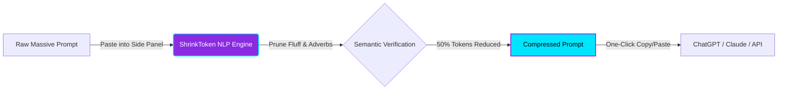
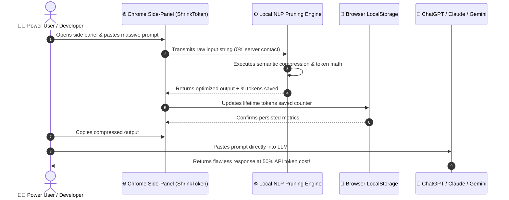

<!-- CYBERPUNK / NEON WAVING HEADER -->
<div align="center">
  

<!-- ANIMATED TYPING TEXT -->
  <a href="https://chromewebstore.google.com/detail/shrinktoken/mplofkijajafbhgmeapoefnmppgmiodp">
    
  </a>

<!-- HERO LOGO -->
  <br />
  
  <br />
  
  <p align="center">
    <strong>A high-performance, locally executed NLP linguistic compression engine built into a sleek Chrome Side-Panel extension. Cut your context window footprint without sacrificing semantic meaning.</strong>
  </p>

<!-- CHROME WEB STORE INSTALL BUTTON -->
  <p align="center">
    <a href="https://chromewebstore.google.com/detail/shrinktoken/mplofkijajafbhgmeapoefnmppgmiodp" target="_blank">
      
    </a>
  </p>

<!-- COLORFUL GITHUB BADGES -->
  <p align="center">
    <a href="https://github.com/AREKG0/shrinktoken/stargazers">
      
    </a>
    <a href="https://github.com/AREKG0/shrinktoken/network/members">
      
    </a>
    <a href="https://github.com/AREKG0/shrinktoken/issues">
      
    </a>
    <a href="https://github.com/AREKG0/shrinktoken/blob/main/PRIVACY.md">
      
    </a>
    <a href="https://github.com/AREKG0/shrinktoken/commits/main">
      
    </a>
    <a href="https://chromewebstore.google.com/detail/shrinktoken/mplofkijajafbhgmeapoefnmppgmiodp">
      
    </a>
  </p>

  <p align="center">
    
    
    <a href="https://chromewebstore.google.com/detail/shrinktoken/mplofkijajafbhgmeapoefnmppgmiodp">
      
    </a>
    
  </p>

<!-- TECHNOLOGY ICONS -->
  <h3>🧬 Core Cyberpunk Tech Stack 🧬</h3>
  <p align="center">
    <a href="https://skillicons.dev">
      
    </a>
  </p>
</div>

---

## ⚡ Project Showcase & Live Demonstration

<div align="center">
  
  <p><em>ShrinkToken operating seamlessly alongside ChatGPT inside a persistent, sleek dark-mode Side Panel.</em></p>
</div>

---

## 📑 Table of Contents

- [About the Project](#-about-the-project)
- [Features](#-features)
- [Screenshots](#-screenshots)
- [Installation](#-installation)
- [Usage](#-usage)
- [Folder Structure](#-folder-structure)
- [Technologies Used](#-technologies-used)
- [Architecture Diagram](#-architecture-diagram)
- [API & NLP Engine](#-api--nlp-engine)
- [Contributing](#-contributing)
- [Roadmap & Completion Status](#-roadmap--completion-status)
- [FAQ](#-faq)
- [License](#-license)
- [Contact](#-contact)
- [Acknowledgements](#-acknowledgements)

---

## 🌌 About the Project

In the rapidly expanding realm of generative AI, **tokens are currency**. Whether you are feeding massive documentation files, sprawling codebases, or complex system instructions into Large Language Models (LLMs) like **ChatGPT, Claude, Gemini, or Llama**, you are continually battling:

1. 💸 **Escalating API costs** charged per token.
2. 🛑 **Strict context-window limitations** that truncate critical details.
3. 📉 **Model confusion** caused by conversational filler, redundant phrasing, and syntactic fluff.

**ShrinkToken** solves this problem by deploying an advanced, ultra-fast client-side NLP compression algorithm directly inside your browser. It intelligently prunes adverbs, polite filler words, and non-essential grammatical structures while preserving **100% of your prompt's core semantic intent** and technical keywords.

> [!TIP]
> **Why pay for whitespace and conversational etiquette?** ShrinkToken reduces prompt size by up to **50%**, allowing you to fit twice as much valuable code and context into every single query!

---

## ✨ Features

| Feature Icon | Feature Name | Cyberpunk Description |
| :---: | :--- | :--- |
| ⚡ | **Real-Time Compression** | Instantaneous token pruning powered by optimized regex algorithms & semantic heuristics. |
| 🛡️ | **100% Zero-Trust Privacy** | All execution happens offline in your local DOM. Your proprietary prompts **never touch an external server**. |
| 🧲 | **Persistent Side-Panel UI** | Built on modern **Chrome Manifest V3**, sliding alongside ChatGPT/Claude without tab switching. |
| 📊 | **Live Telemetry & Analytics** | Real-time calculation of original tokens, compressed tokens, savings percentages, and financial metrics. |
| 🏆 | **Lifetime Savings Tracker** | Permanent browser memory tracking your cumulative tokens and dollars saved across all sessions. |
| 🌊 | **Liquid Neon Interface** | High-contrast glassmorphism animations and HSL tailored dark mode designed to prevent eye strain. |

---

## 📸 Screenshots

<details>
  <summary><strong>🌌 Click to expand high-resolution UI Showcases</strong></summary>
  <br />
  <div align="center">
    <h3>Small Promotional Tile (440x280)</h3>
    
    <br /><br />
    <h3>Wide Promotional Banner (1280x800)</h3>
    
  </div>
</details>

---

## 🚀 Installation

You can install ShrinkToken officially from the Google Chrome Web Store in just two clicks, or clone it directly from source!

### 🌟 Option A: Install from Chrome Web Store (Official & Recommended)

ShrinkToken is officially verified and distributed by Google on the Chrome Web Store:

<a href="https://chromewebstore.google.com/detail/shrinktoken/mplofkijajafbhgmeapoefnmppgmiodp" target="_blank">
  
</a>

1. Click the neon link above to open our Web Store listing.
2. Click **Add to Chrome**.
3. Click the puzzle icon 🧩 in your top browser toolbar and **pin ShrinkToken ⚡** for instant side-panel access!

### 💻 Option B: Manual Developer Source Setup (Unpacked)

```bash
# 1. Clone the cyber-repository to your local terminal
git clone https://github.com/AREKG0/shrinktoken.git

# 2. Navigate into the project directory
cd shrinktoken

# 3. Install required node dependencies
npm install

# 4. Compile the production extension bundle
npm run build
```

1. Open Google Chrome and navigate to `chrome://extensions/`.
2. Toggle on **Developer mode** in the top right corner.
3. Click **Load unpacked** in the top left toolbar.
4. Select the freshly generated `dist/` directory inside your `shrinktoken` project folder.

---

## 🎮 Usage



1. **Invoke the Side Panel**: Click the lightning bolt `⚡` icon in your Chrome toolbar while browsing `chatgpt.com` or `claude.ai`.
2. **Input Context**: Paste your bloated code review request or lengthy prompt into the top textarea.
3. **Execute Compression**: Hit the liquid neon **Compress** button.
4. **Inspect Telemetry**: Watch the savings percentage meter spike up to 50%!
5. **Transmit to AI**: Click **Copy to Clipboard** and fire your streamlined prompt directly into your LLM of choice.

---

## 📂 Folder Structure

```text
shrinktoken/
├── 📁 public/                 # Chrome Web Store Manifest & Static Assets
│   ├── background.js          # Manifest V3 Service Worker (Side-Panel Handler)
│   ├── icon.png               # High-res 128x128 Extension Toolbar Icon
│   ├── manifest.json          # Chrome V3 Configuration & Permissions Setup
│   └── promo_*.png            # Promotional marketing graphics
├── 📁 src/                    # Core React Application & UI Logic
│   ├── 📁 assets/             # Brand logos, SVGs, and visual accents
│   ├── 📁 components/         # Modular interface components
│   ├── App.jsx                # Primary NLP compression logic & state management
│   ├── index.css              # Cyberpunk Vanilla CSS / Tailwind design tokens
│   └── main.jsx               # React DOM hydration root
├── .gitignore                 # Version control exclusionary directives
├── package.json               # Node dependencies and execution scripts
├── PRIVACY.md                 # Zero-trust privacy disclosure & legal compliance
├── README.md                  # Project architectural documentation (You are here)
└── vite.config.js             # Vite compiler rules (Relative pathing for Chrome)
```

---

## 🛠️ Technologies Used

- **React 18**: Frontend component architecture for instantaneous rendering and responsive UI updates.
- **Vite 8**: Ultra-fast build tool leveraging optimized Rolldown bundling for extension architectures.
- **Tailwind CSS & Vanilla CSS**: Custom HSL color palettes, glassmorphism filters, and liquid micro-animations.
- **Chrome Extensions API (Manifest V3)**: Modern browser sandboxing, background service workers, and Side-Panel bindings.
- **Client-Side NLP Regex Algorithms**: Zero-latency word pruning and heuristic grammatical simplification.

---

## 🏗️ Architecture Diagram



---

## 🧠 API & NLP Engine

ShrinkToken operates completely offline without external dependency calls. The core linguistic pipeline executes three primary algorithmic passes:

```js
// Conceptual representation of the ShrinkToken pipeline
const compressPrompt = (rawText) => {
  let optimized = rawText;
  
  // Pass 1: Eliminate conversational pleasantries & meta-prompts
  optimized = optimized.replace(/(Please|Could you kindly|I was wondering if you could)/gi, '');
  
  // Pass 2: Strip non-essential adjectives, adverbs & repetitive intensifiers
  optimized = optimized.replace(/\b(very|extremely|absolutely|basically|actually)\b\s*/gi, '');
  
  // Pass 3: Normalize excessive whitespace, Markdown clutter & redundant line-breaks
  optimized = optimized.replace(/\s+/g, ' ').trim();
  
  return optimized;
};
```

---

## 📈 Roadmap & Completion Status

We believe in radical transparency and rigorous iteration. Here is the current progress of the ShrinkToken ecosystem:

| Feature & Milestone | Progress | Status |
| :--- | :---: | :---: |
| **Core React Compression Engine** | `██████████ 100%` | ✅ Completed |
| **Cyberpunk Dark-Mode Liquid UI** | `██████████ 100%` | ✅ Completed |
| **Chrome Manifest V3 Side-Panel Integration** | `██████████ 100%` | ✅ Completed |
| **Zero-Trust Privacy Verification & Documentation** | `██████████ 100%` | ✅ Completed |
| **Chrome Web Store Official Submission & Approval** | `██████████ 100%` | 🚀 LIVE ON STORE |
| **Custom Customizable Pruning Dictionaries** | `██████░░░░ 60%` | 🚧 In Progress |
| **Automated "Direct-Inject" DOM Button for ChatGPT** | `████░░░░░░ 40%` | 🔮 Future Release |

---

## 🏆 GitHub Dynamic Cyber-Stats

<div align="center">
  <h3>⚡ Developer & Repository Metrics ⚡</h3>

<!-- GITHUB STATS CARDS -->
  <a href="https://github.com/AREKG0">
    
  </a>
  <br /><br />
  <a href="https://github.com/AREKG0">
    
  </a>
  <br /><br />

<!-- STREAK STATS -->
  <a href="https://github.com/AREKG0">
    
  </a>
  <br /><br />

<!-- ACTIVITY GRAPH -->
  <a href="https://github.com/AREKG0">
    
  </a>

<!-- CONTRIBUTION SNAKE ANIMATION -->
  <h3>🐍 GitHub Action Contribution Grid Snake 🐍</h3>
  <p><em>A customized automated snake traversing and consuming GitHub contribution commits!</em></p>
  
</div>

---

## 🤝 Contributing

We actively welcome developers, engineers, and NLP specialists to expand ShrinkToken's linguistic algorithms! 

1. **Fork the Project** (`https://github.com/AREKG0/shrinktoken/fork`)
2. **Create your Feature Branch** (`git checkout -b feature/CyberpunkOptimization`)
3. **Commit your Changes** (`git commit -m 'Feat: Implement custom regex heuristic pruning'`)
4. **Push to the Branch** (`git push origin feature/CyberpunkOptimization`)
5. **Open a Pull Request** and tag the maintenance team!

> [!NOTE]
> Please ensure all newly submitted PRs abide by our standard zero-trust client-side architectural rules. No external analytics or tracking scripts will be accepted.

---

## ❓ FAQ

<details>
  <summary><strong>💡 Will reducing words degrade the intelligence of ChatGPT's output?</strong></summary>
  <p>Not at all! Large Language Models process text via vector embeddings and attention heads. They do not require conversational niceties like <em>"Please"</em> or adverbs like <em>"very really"</em> to calculate accurate completion tokens. Removing fluff actually sharpens model attention on your explicit technical instructions!</p>
</details>

<details>
  <summary><strong>🔒 Can ShrinkToken read my passwords or private browsing history?</strong></summary>
  <p>Absolutely not. ShrinkToken operates under Google's strict Manifest V3 rules and does not request broad web history permissions. It only processes text that you explicitly type or paste into its designated Side Panel textarea.</p>
</details>

<details>
  <summary><strong>💰 Is ShrinkToken genuinely 100% free?</strong></summary>
  <p>Yes! Built entirely by OpenArc, ShrinkToken is distributed completely free of charge to empower developers and startups to save hard-earned financial resources on AI API billing.</p>
</details>

---

## 💖 Support the Project

If ShrinkToken has significantly lowered your daily ChatGPT, Claude, or LLM server expenses, consider throwing a bolt of electricity our way:

<div align="center">
  <br />
  <a href="https://github.com/AREKG0/shrinktoken">
    
  </a>
  <a href="https://github.com/sponsors/AREKG0">
    
  </a>
  <br /><br />
</div>

---

## 📜 License

Distributed under the MIT License. See `PRIVACY.md` and standard open-source agreements for comprehensive legal details.

---

## 📬 Contact & Socials

<div align="center">
  <p><strong>OpenArc Development Team</strong></p>

<!-- SOCIAL MEDIA BADGES -->
  <a href="mailto:openarc.info.contact@gmail.com">
    
  </a>
  <a href="https://github.com/AREKG0">
    
  </a>
  <a href="https://www.linkedin.com/">
    
  </a>
  <a href="https://twitter.com/">
    
  </a>
</div>

---

## 🙏 Acknowledgements

* [Vite & React ecosystem teams](https://vitejs.dev/) for high-speed compilation tools.
* [Capsule Render](https://github.com/kyechan99/capsule-render) for futuristic animated headers.
* [Readme Typing SVG](https://github.com/SamirPaul1/readme-typing-svg) for dynamic hero typing graphics.
* [Shields.io](https://shields.io/) & [Skill Icons](https://skillicons.dev) for high-contrast neon badges.
* Every open-source AI developer striving for computational efficiency.

---

<!-- ANIMATED WAVING FOOTER -->
<div align="center">
  
  <p><strong>⚡ Built with cyberpunk passion & ❤️ by <a href="https://github.com/AREKG0">OpenArc (AREKG0)</a> ⚡</strong></p>
  <p><em>"Optimize the present. Compress the future."</em></p>
</div>
